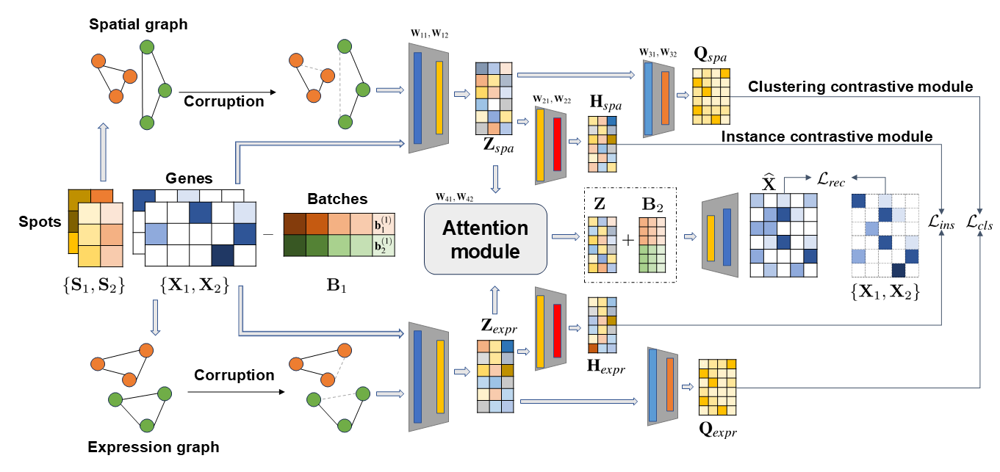

# spCLUE

A Contrastive Learning Approach to Unified Spatial Transcriptomics Analysis Across Single-Slice and Multi-Slice Data

## Overview

Taking a two-slice dataset as an example, spCLUE begins by constructing a multi-view graph (spatial view and expression view) for each slice. Next, it extracts spot representations through a graph contrastive learning framework, incorporating a batch prompting module, a clustering contrastive module, and an instance contrastive module. Finally, an attention module integrates the spot embeddings learned from the two contrastive modules, and the decoder reconstructs the gene expression profiles. Given the trained model, spot representations are finally extracted at the bottleneck layer, which are used to identify spatial domains.



## Requirements

We recommend that users install the following packages to run spCLUE.

- python==3.9.0
- torch==1.13.1
- numpy==1.23.5
- scanpy==1.9.3
- anndata==0.8.0
- rpy2==3.4.1
- pandas==1.5.3
- scipy==1.10.0
- scikit-learn==1.2.2
- tqdm==4.64.1
- matplotlib==3.7.0
- seaborn==0.12.2
- jupyter==1.0.0
- R==4.2.0
- mclust==6.0.0

You can install spCLUE with **anaconda** using the following commands:

```shell
conda create -n spCLUE python=3.9.0
conda activate spCLUE
pip install -r requirements.txt
```

## Tutorial

Please find examples of spCLUE applications in the tutorial folder, where jupyter notebooks are provided.

**NOTE:** Please update the data paths before running the code.

## Datasets

The example spatial transcriptomics datasets can be downloaded with the links below.

- **DLPFC**: [*http://spatial.libd.org/spatialLIBD/*](http://spatial.libd.org/spatialLIBD/).
- **BRCA**: [*https://github.com/JinmiaoChenLab/SEDR_analyses/tree/master/data*](https://github.com/JinmiaoChenLab/SEDR_analyses/tree/master/data).
- **BARISTA**: [*http://sdmbench.drai.cn*](http://sdmbench.drai.cn).
- **MOB1**: [*https://singlecell.broadinstitute.org/single_cell/study/SCP815/highly-sensitive-spatial-transcriptomics-at-near-cellular-resolution-with-slide-seqv2#study-summary*](https://singlecell.broadinstitute.org/single_cell/study/SCP815/highly-sensitive-spatial-transcriptomics-at-near-cellular-resolution-with-slide-seqv2#study-summary).
- **MOB2**: [*https://github.com/JinmiaoChenLab/SEDR_analyses/tree/master/data*](https://github.com/JinmiaoChenLab/SEDR_analyses/tree/master/data).
- **MOSTA**: [*https://db.cngb.org/stomics/mosta/*](https://db.cngb.org/stomics/mosta/).
